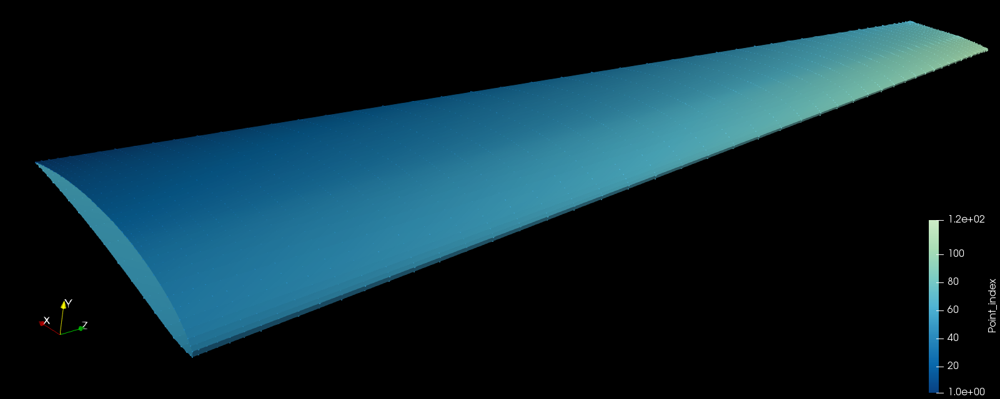
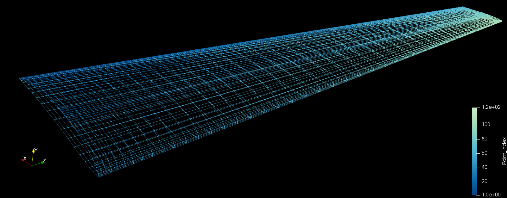

# VTKtools
Methods for the manipulation of geometric data and formatting into VTK format.

# Dependencies
  * Paraview  : Not needed, but examples call Paraview for visualization of
      outputs. Installing through `apt-get install paraview` is not recommended
      since it may have troubles linking the python libraries, instead follow
      the official [Paraview](https://www.paraview.org/Wiki/ParaView:Build_And_Install).

# Authorship
  * Author    : Eduardo J Alvarez
  * Email     : Edo.AlvarezR@gmail.com
  * Created   : Nov 2017
  * License   : MIT License
