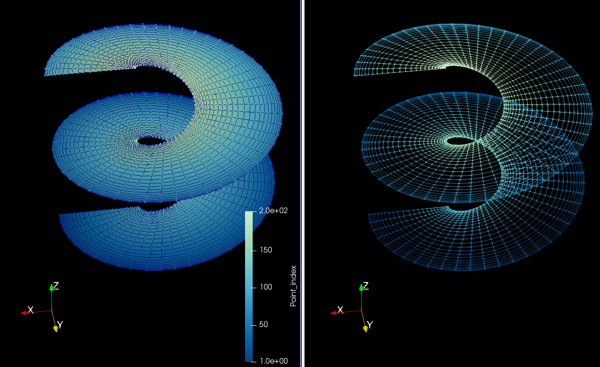
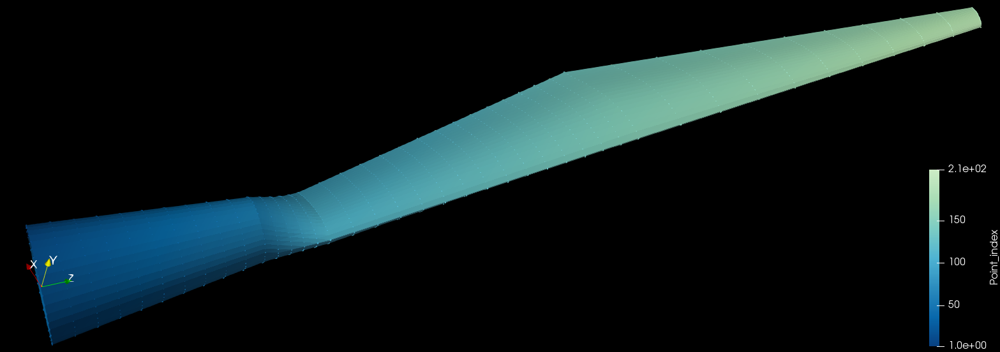
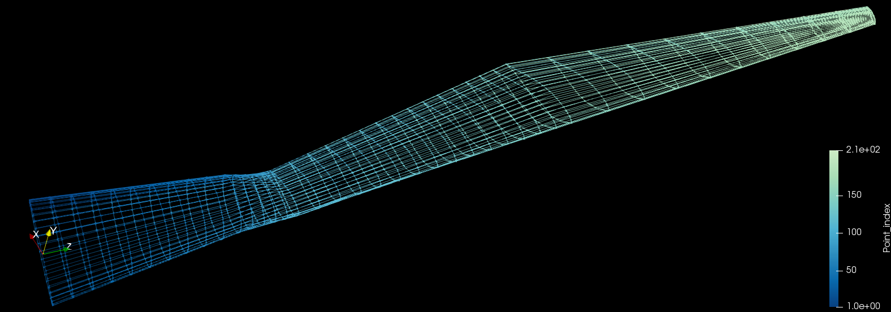

# VTKtools
Methods for the manipulation of geometric data and formatting into VTK format.





See `docs` for code documentation and `examples` for usage examples.

# Dependencies
  * Paraview  : Not needed, but examples call Paraview for visualization of
      outputs. Installing through `apt-get install paraview` is not recommended
      since it may have troubles linking the python libraries, instead follow
      the official [Paraview](https://www.paraview.org/Wiki/ParaView:Build_And_Install).

# Extra Instructions for MacOS
  * The examples call Paraview from the command line as a Julia command wrapper
    of the form `run(`paraview`)`, requiring Paraview to be accessible from
    the command line. If you installed Paraview as a precompiled application,
    Paraview is not accessible from the command line unless you add it into the
    system path. To do so, add this line to the `.bash_profile` file:
    ```bash
    export PATH=$PATH:/Applications/ParaView-5.4.0.app/Contents/MacOS/
    ```
    , where `ParaView-5.4.0.app` must be replaced by the version you have
    installed. To verify that Paraview has correctly been added to the system
    path, opening a new terminal and typing `paraview` should open up a new
    Paraview process.

# Authorship
  * Author    : Eduardo J Alvarez
  * Email     : Edo.AlvarezR@gmail.com
  * Created   : Nov 2017
  * License   : MIT License
